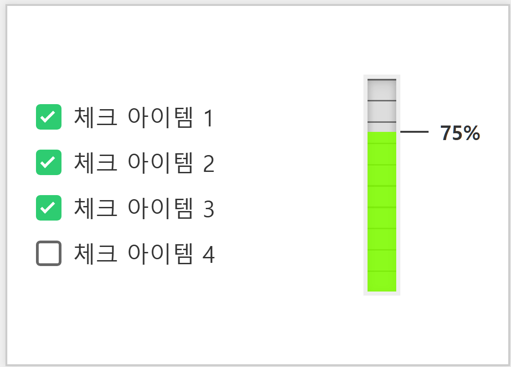

# butterflyEffect



React + Vite + TypeScript로 구성된 예시 프로젝트입니다.  
(간단히 “나비 효과(Butterfly Effect)”라는 이름을 붙였습니다.)

프로젝트 주제 : 체크 리스트와 연동된 달성률 게이지 바 UI 구현

기능

[x] 체크 박스를 누르고 종료 버튼을 누르면 달성률에 누적
[x] 체크리스트가 뜰 때, 옆에 달성률 막대 그래프 UI 구현

## 설치

```bash
# github에서 해당 프로젝트를 clone한 뒤, 프로젝트 폴더로 이동

git clone https://github.com/ButterflyEffectTeam/butterflyEffect.git
cd ButterflyEffect

# 의존성 설치
npm install
```

## 사용법

```bash
npm run dev

#이후 해당 로컬 URL 클릭 or 주소창 입력
```

## 기여하기

1. 저장소를 fork 해주세요.
2. 새 브랜치 만들고 수정사항을 push해주세요.
3. PR을 요청하고 문서 양식 맞춰서 내용 기입해주세요.

## 라이센스

MIT 라이센스에 따라 제공되는 오픈 소스 소프트웨어입니다.
